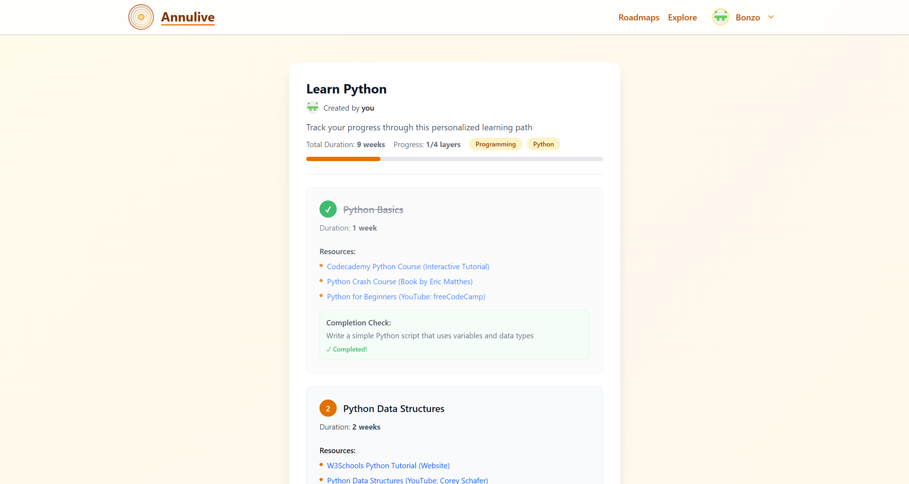

# Annulive 🚀

**Social media AI app where users can create and share their own roadmaps learning the skills they want to.**

Annulive is a platform that combines social networking with AI-powered learning. Users can create personalized learning roadmaps, share their progress, and discover new skills through an engaging, community-driven experience.

🏆 **Built for the [boot.dev Hackathon](https://boot.dev) (July 25-28, 2025)**

### 📝 Notes

_This project focused on 3 main goals: building a social media + AI MVP platform, improving Python coding, and learning how to use a PAAS like Digital Ocean to host the application. AI assistance was used for styling to accelerate development._

🌐 **[Live Demo](https://annu.live)** - Try Annulive now!



## ✨ Features

- **AI-Powered Roadmaps**: Create intelligent learning paths tailored to your goals
- **Social Learning**: Share your progress and discover what others are learning
- **Community-Driven**: Connect with learners on similar paths
- **Skill Tracking**: Monitor your progress and celebrate milestones
- **Personalized Experience**: AI-driven recommendations based on your interests

## 🛠️ Tech Stack

- **Frontend**: [Next.js 15](https://nextjs.org) with React 19
- **Backend**: Python microservices hosted on [DigitalOcean Functions](https://www.digitalocean.com/products/functions)
- **Database**: [MongoDB](https://www.mongodb.com/) for data storage
- **Authentication & Authorization**: [Auth0](https://auth0.com/) for secure user management
- **Styling**: [Tailwind CSS 4](https://tailwindcss.com) with custom animations
- **Icons**: [Lucide React](https://lucide.dev/) for beautiful icons
- **TypeScript**: Full type safety throughout the application

## Project Structure

```
├── packages/           # Backend services (Python)
│   ├── ai/            # AI-powered features
│   │   └── generateRoadmap/  # AI roadmap generation service
│   ├── roadmaps/      # Roadmap management services
│   │   ├── editRoadmap/      # Edit existing roadmaps
│   │   ├── getRoadmap/       # Fetch single roadmap
│   │   ├── getRoadmaps/      # Fetch multiple roadmaps
│   │   ├── getUserRoadmaps/  # User-specific roadmaps
│   │   └── saveRoadmap/      # Save roadmap data
│   └── users/         # User management services
│       ├── getUser/          # Fetch user data
│       └── saveUser/         # Save user data
├── src/               # Frontend (Next.js)
│   ├── app/          # Next.js App Router pages
│   │   ├── (platform)/      # Platform routes
│   │   │   ├── explore/      # Explore roadmaps page
│   │   │   ├── profile/      # User profile page
│   │   │   └── roadmaps/     # Roadmap management pages
│   │   └── components/       # Landing page components
│   ├── components/    # Reusable UI components
│   │   ├── roadmap/          # Roadmap-specific components
│   │   └── ui/              # Base UI components (Radix + custom)
│   ├── contexts/     # React contexts (UserContext)
│   ├── lib/          # Utility functions and configurations
│   └── middleware.ts # Next.js middleware for authentication
└── public/           # Static assets
```

## 📄 License

This project is licensed under the MIT License - see the [LICENSE](LICENSE) file for details.

**Start your learning journey today with Annulive!** 🎯
